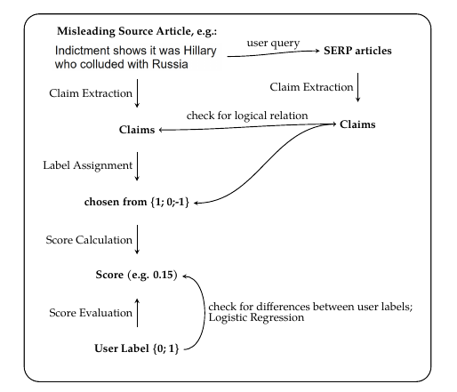

# VeriClaim: Using Claim Alignment with Search Results to Predict News Trust

This is the accompanying repository to my master's thesis "VeriClaim: Using Claim Alignment with Search Results to Predict News Trust".

### Overview

In this project, I present a context-specific predictor of users believing (misleading) articles that is based on claim extraction. 
Considering this thesis' methodological outline, this repository follows the key steps that have been discerned:

0. Data Pre-Processing ([pre_processing](./pre_processing/))
1. Claim Extraction ([claim_extraction](./claim_extraction/))
2. Label Assignment ([label_assignment](./label_assignment/))
3. Score Calculation ([score_calculation](./score_calculation/))
4. Score Evaluation (integrated in [score_calculation](./score_calculation/))

On a general level, these steps follow the following flowchart:
